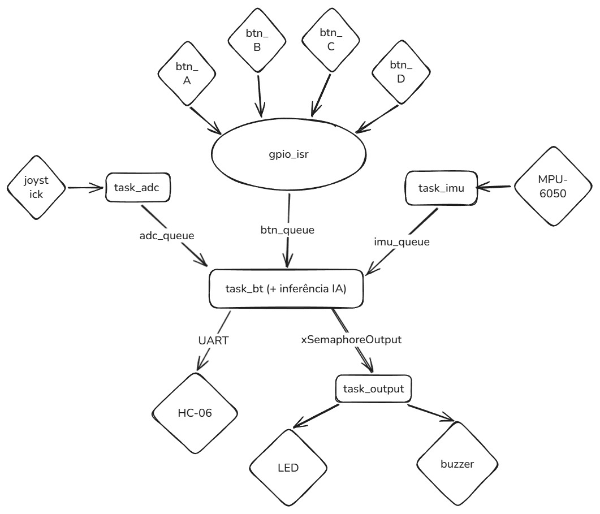

# 🔫 APS-2 — Controle Temático: The House of the Dead Remake

## Jogo

**The House of the Dead Remake** (PC, Windows)  
Shooter on-rails (trilho fixo) estilo arcade. O jogador não controla movimento — o personagem avança sozinho pelo cenário enquanto o jogador mira e atira em zumbis que surgem na tela. Revólveres têm 6 balas por carregador, exigindo recargas manuais frequentes.

---

## Ideia do Controle

Formato de **pistola/revólver** segurado com uma mão, inspirado na Light Gun original do arcade.

- **IMU** embutido no cano → inclinar/girar a pistola controla a mira (substitui o mouse)
- **Botão R (gatilho)** embaixo do indicador → atirar (LMB)
- **Botão G** → recarregar manualmente (tecla R)
- **Botão B** → pausar / confirmar menu (Enter/Esc)
- **Gesto de chacoalhar** → IA classifica movimento do IMU → envia tecla de recarga (R)

```
         ___________
        |           |
        |  [IMU]    |
[BTN G]-|           |
[BTN B]-|___________|
           |
        [BTN R / gatilho]
```

O gesto de **recarga** é o diferencial: chacoalhar fisicamente a pistola → acelerômetro detecta pico → modelo de IA classifica → envia `R` ao jogo. Intuitivo e fiel à mecânica de revólver.

---

## Inputs e Outputs

| Tipo | Componente | Função no Jogo |
|---|---|---|
| Input | IMU — MPU-6050 (I2C) | Controle de mira (mouse X/Y) |
| Input | IMU — acelerômetro | Gesto de recarga (chacoalhar → tecla R) |
| Input | Botão R (gatilho) | Atirar (LMB) |
| Input | Botão G | Recarregar (tecla R) |
| Input | Botão B | Pausar / Confirmar (Enter/Esc) |
| Output | LED RGB | Status de conexão Bluetooth |
| Output | Buzzer | Feedback ao levar dano |
| Output | HC-06 (UART→BT) | Envio de comandos ao PC |

---

## Protocolo

**Bluetooth Serial (HC-06)** via UART.  
O firmware envia pacotes ao PC. Um script Python recebe os dados, roda o modelo de IA e converte para eventos de teclado/mouse via `pyserial` + `pynput`.

**Formato do pacote serial:**
```
[0xAA][TYPE 1B][VALUE 2B][0xFF]
```

| TYPE | Conteúdo |
|---|---|
| `0x01` | IMU ângulo X/Y (mira) |
| `0x02` | IMU aceleração XYZ (gesto de recarga) |
| `0x03` | Estado dos botões (bitmask: R, G, B) |

---

## IA — Classificação de Gesto de Recarga

O gesto de **chacoalhar** a pistola é detectado por um modelo treinado com dados do acelerômetro (MPU-6050). O modelo distingue o chacoalhar intencional de movimentos normais de mira.

---

## Diagrama de Blocos do Firmware



| Elemento | Descrição |
|---|---|
| **Task IMU** | Lê MPU-6050 via I2C (ângulo + aceleração), posta na fila de envio |
| **Task BT** | Consome fila de botões + dados IMU, monta e envia pacote UART |
| **Task Output** | Controla LED RGB (status conexão) e buzzer (dano) |
| **ISR GPIO** | Detecta borda de descida dos botões R/G/B, envia para `btn_queue` |
| **btn_queue** | Fila FreeRTOS entre ISR e Task BT |
| **Semáforo IMU** | Sincroniza Task IMU com Task BT |

---

## Mapeamento de Pinos

| Pino | Sinal |
|---|---|
| GP4 | Botão R (gatilho — atirar) |
| GP5 | Botão G (recarregar) |
| GP6 | Botão B (pausar/confirmar) |
| GP7 | LED R |
| GP8 | LED G |
| GP9 | LED B |

---

## Estrutura do Repositório

```
/
├── main/
│   ├── main.c               # firmware principal (tasks FreeRTOS)
│   ├── pins.h               # mapeamento de pinos
│   ├── hc06.h / hc06.c      # driver HC-06 (AT commands + UART)
│   └── mpu6050.h            # defines de registradores do MPU-6050
├── Fusion/                  # biblioteca Fusion AHRS (pitch/roll via giroscópio)
├── pc/
│   └── receiver.py          # recebe pacotes BT e envia inputs ao jogo
└── README.md
```
